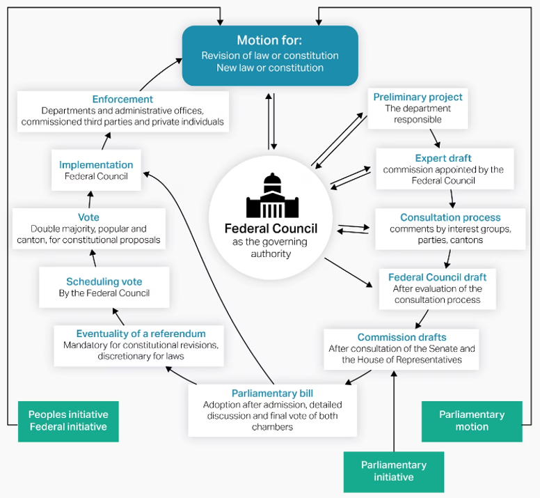

---
title: "Health policy in Switzerland"
subtitle: |
  25 September 2026 (Lucerne) and 1 October 2026 (Bern)

author:
  - "Ass.-Prof. Dr. David Weisstanner"
  - "Dr. Victoria A. Haerter"

institute:
  - "Center for Health, Policy and Economics (CHPE), Faculty of Health Sciences and Medicine, University of Lucerne"
  - "Center for Health, Policy and Economics (CHPE), Faculty of Health Sciences and Medicine, University of Lucerne"

footer: "Health Policy in Switzerland · Day 1 · 25.09.2026"

output-file: slides_day1.html

format:
  revealjs:
    theme: [default, custom.scss]
    logo: images/unilu-logo.png
    slide-number: true
    transition: none
    background-transition: fade
    center: false
    controls: true
    progress: true
    hash: true
    width: 1600
    height: 900
    margin: 0.06
    code-fold: false

    title-slide-attributes:
      data-background-image: images/bundeshaus.png
      data-background-size: "130% auto"
      data-background-position: "left top"
      data-background-opacity: "0.8"
      data-background-color: "#ffffff"

    include-in-header:
      text: |
        <style>
        .policy-cycle {
          transform: scale(0.9);
          transform-origin: top center;
          position: relative;
          width: 560px;
          height: 560px;
          margin: -3rem auto -8rem auto;
        }

        .policy-cycle .cycle-item {
          position: absolute;
          top: 50%;
          left: 50%;
          width: 170px;
          margin-left: -75px;
          text-align: center;
          transform: rotate(var(--a)) translate(250px) rotate(calc(-1 * var(--a)));
          flex: 1;
          background: #f5f5f5;
          border-top: 5px solid #b51f2e;
          padding: 0.5em;
        }

        .policy-cycle .cycle-arrow {
          position: absolute;
          top: 50%;
          left: 50%;
          width: 32px;
          height: 32px;
          margin-left: -16px;
          margin-top: -16px;
          text-align: center;
          color: #b51f2e;
          font-size: 2rem;
          transform: rotate(var(--a)) translate(250px) rotate(90deg);
        }

        .pos-1 { --a: -90deg; }
        .pos-2 { --a: -18deg; }
        .pos-3 { --a: 54deg; }
        .pos-4 { --a: 126deg; }
        .pos-5 { --a: 198deg; }

        .arrow-pos-1 { --a: -40deg; }
        .arrow-pos-2 { --a: 40deg; }
        .arrow-pos-3 { --a: 88deg; }
        .arrow-pos-4 { --a: 135deg; }
        .arrow-pos-5 { --a: -140deg; }

        .key-message.small {
          font-size: 0.8em;
          margin-top: 12rem;
        }
        </style>

editor:
  markdown:
    wrap: 72
---


## Welcome

### Health policy in Switzerland

Over the next two days, we will ask one central question:

::: key-message
Why is solving major health-policy problems in Switzerland so
politically difficult — and under what conditions can change
nevertheless happen?
:::

::: notes
Welcome everyone.

The course is organised around one overarching question.

Switzerland faces many well-known healthcare problems and there is
usually no shortage of proposals for addressing them.

What interests us in this course is therefore not only what would be
desirable from a health-policy perspective.

We want to understand why some reforms become politically possible, why
others fail or are substantially modified, and how the institutional
structure of Swiss politics shapes these outcomes.
:::

## Who we are

::: {style="height: 0.8em;"}
:::

::::: columns
::: {.column width="50%"}
### David Weisstanner

Assistant Professor of Health and Social Policy\
University of Lucerne

- Health Policy, Social Policy
- Inequality, Public Opinion, and Voting Behaviour
- Comparative and Quantitative Research

[**UniLU
profile**](https://www.unilu.ch/en/faculties/faculty-of-health-sciences-and-medicine/professorships-lecturers-researchers/professorships/asst-prof-david-weisstanner-phd/)
·
[**LinkedIn**](https://www.linkedin.com/in/david-weisstanner-98104668/)
:::

::: {.column width="50%"}
### Victoria A. Haerter

Postdoctoral Researcher\
University of Lucerne

- Political Psychology
- Political Behavior and Attitudes
- Quantitative Methods

[**UniLu
profile**](https://www.unilu.ch/en/faculties/faculty-of-health-sciences-and-medicine/professorships-lecturers-researchers/postdocs/victoria-haerter-phd)
· [**LinkedIn**](https://www.linkedin.com/in/victoria-andrea-haerter/)
:::
:::::

::: {style="height: 0.8em;"}
:::

**Current SNSF project:** [*Party politics and the politicization of
health care*](https://data.snf.ch/grants/grant/10003941) (2025–2029)

## And you?

### A quick tour de table

- **Name**
- **Background / discipline**
- **PhD project (if applicable)**
- **What brings you to this course?**

## Your turn first

### If you were head of the EDI, what health-policy reform would you introduce as your top priority?

::: card
**Imagine you are Federal Councillor Elisabeth Baume-Schneider.**

{fig-align="center" width="20%"}

Scan the QR code and submit **one reform proposal**.

*There is no need to justify it — yet.*
:::

::: notes
Before we begin, I would like to hear from you.

Imagine that tomorrow you become head of the Federal Department of Home
Affairs.

You can put one major health-policy reform at the top of the agenda.

What would it be?

We will briefly look at the responses together.

Do not worry yet about feasibility. The purpose of the course is
precisely to understand what happens between a desirable idea and an
actual policy reform.
:::

## From policy ideas to political reform

### Recurring questions in Swiss health policy

- **Who can decide?** Confederation, Cantons, or is it none of the
  state's business?
- **Who pays, who gains, who loses?** How are costs, benefits, access,
  autonomy and authority distributed?
- **Who can shape the reform?** Who can support, modify or block it?
- **How can change happen?** What path through the political process is
  possible?
- **Who makes it work?** Who is responsible for implementation, and how
  do we know whether it works?

::: key-message
A good policy idea is not yet a **politically feasible and workable
reform**.
:::

## How we will approach this

### From understanding the system to seeing policy in practice

:::::: columns
::: {.column .card width="31%"}
### 1. Analytical toolkit

**How does Swiss health policy work?**

Institutions\
Actors and interests\
Political process
:::

::: {.column .card width="31%"}
### 2. Five big questions

**How do we apply the toolkit to major policy challenges?**

Understand the problem\
Analyse the politics\
Develop policy solutions
:::

::: {.column .card width="31%"}
### 3. Policy in practice

**How does it work in the real world?**

Canton of Bern\
Federal Palace\
Exchange with policymakers
:::
::::::

## Analytical toolkit {.section-divider}

::: kicker
Part 1
:::

### How does Swiss health policy work?

## Three questions

### Our analytical toolkit

1.  **Who can decide?**\
    Institutions and responsibilities

2.  **Who wants what?**\
    Actors, interests and political conflict

3.  **How does change happen?**\
    The Swiss policy process

::: key-message
We will use these three questions throughout the course.
:::

::: notes
Our analytical toolkit follows three questions with which in the end you
can answer how Swiss health policy work?

The idea is that following these questions you can analyse and explain
any Swiss (health) policy.

Hint hint..
:::

## 1. Who can decide? {.section-divider}

::: kicker
Analytical toolkit
:::

### Institutions and responsibilities

::: notes
We start with our first analytical question: Who can decide?

To understand who are the actors and what do they do, we need to
understand the environment they operate in, therefore, we need to
understand the institutional rules.

Three features are particularly important in Switzerland: **federalism**
(and **subsidiarity**), **direct democracy**, and **power sharing** and
(**negotiated governance**).
:::

## Who can decide?

### Three institutional features

1.  **Federalism and subsidiarity**\
    Political authority is distributed across levels of government.

2.  **Direct democracy**\
    Citizens can directly intervene in political decisions.

3.  **Power sharing and negotiated governance**\
    Political decisions typically require compromise and coordination
    across institutions and organised interests.

::: key-message
Swiss health policy has **no single centre of political authority**.
:::

::: notes
These three features provide our institutional starting point.

Federalism tells us how authority is distributed **vertically.**

Direct democracy gives citizens an unusually **direct role** in
policymaking.

And power sharing means that policymaking frequently depends on
**negotiation** and **compromise** rather than unilateral government
action.

For now, the emphasis is on the institutional structure.

We will examine the actors operating within this structure — and what
they want — in the next part.
:::

## Federalism

::: notes
First – a very important term for many Swiss political scientists –
Federalism. Who knows what it is?
:::

. . .

### Political power is shared across levels of government

In a **federal state**, both the Confederation and the cantons exercise
their own constitutionally protected powers.

::::: constitutional-quote
::: constitutional-article
Art. 3 BV
:::

> **“The Cantons are sovereign except to the extent that their
> sovereignty is limited by the Federal Constitution.”**

::: constitutional-source
Federal Constitution · [Art. 3
BV](https://www.fedlex.admin.ch/eli/cc/1999/404/en#art_3)
:::
:::::

::: key-message
The key question is therefore: **Who has the constitutional authority to
act?**
:::

::: notes
Federalism means that **power is shared** across all different levels of
government.

Self-rule: cantons hold a lot of **autonomy** but also
**responsibilities**

Shared-rule: also **participate** in the decision-making process on the
federal level.
:::

## How are powers divided?

### The Confederation only has powers assigned by the Constitution

::::: constitutional-quote
::: constitutional-article
Art. 42 Abs. 1 BV
:::

> **“The Confederation shall fulfil the duties that are assigned to it
> by Federal Constitution.”**

::: constitutional-source
Federal Constitution · [Art. 42 Abs. 1
BV](https://www.fedlex.admin.ch/eli/cc/1999/404/en#art_42)
:::
:::::

**Historical origin:** Switzerland developed from a confederation of
largely sovereign cantons into a federal state in **1848**.

::: key-message
Federalism means that **powers are divided**, not simply delegated from
the centre.
:::

::: notes
Now lets go back in time, how did Switzerland become a federal state.

Before the official creation of Switzerland, Switzerland was only a very
loose confederation of mostly sovereign cantons.

Let’s be honest, different regions really liked to fight and have wars
against each other.

Only after a war, called the **Sonderbundeskrieg in 1947** which was one
by the more liberal cantons, in **1848** with the signing of the
**federal constitution** a federal state was created,

but cantons still kept a lot of autonomy.
:::

## How did federal health authority develop?

### Gradual centralisation — without replacing the cantons

:::::::::::::::::::::::: timeline
:::::: timeline-item
::: timeline-year
1848
:::

::: timeline-title
Federal state
:::

::: timeline-text
Health remains predominantly cantonal, with very limited federal
competence for epidemic control.
:::
::::::

:::::: timeline-item
::: timeline-year
1890
:::

::: timeline-title
Insurance competence
:::

::: timeline-text
The Constitution authorises federal legislation on sickness and accident
insurance.
:::
::::::

::::::: timeline-item
::: timeline-year
1912
:::

::: notes
1911 Gesetz, 1912 Referendum, 1918 in Kraft.
:::

::: timeline-title
KUVG / LAMA
:::

::: timeline-text
Federal legislation regulates and subsidises voluntary sickness
insurance.
:::
:::::::

:::::: timeline-item
::: timeline-year
1994
:::

::: timeline-title
KVG / LAMal
:::

::: timeline-text
Mandatory basic insurance creates a much stronger national regulatory
framework.
:::
::::::

:::::: timeline-item
::: timeline-year
Since then
:::

::: timeline-title
Expanding federal role
:::

::: timeline-text
Federal involvement expands further in regulation, quality, professional
standards and public health.
:::
::::::
::::::::::::::::::::::::

::: key-message
The long-term trend is towards **greater federal involvement** — not
towards a fully centralised health system.
:::

::: slide-ref
[@treinHealthPolicy2023, pp. 719–724]
:::

::: notes
Looking at the development of the health system, not one specific point.

It developed incrementally through particular constitutional competences
and pieces of legislation.

propably most important turning point is the **KVG**, adopted in
**1994** and entering into force in **1996.**

It establishes **mandatory basic insurance** and a much stronger
national regulatory framework. Since then, federal involvement has
continued to **expand** in particular areas.

But **cantons** still have a lot of **sovereignty.**

The trajectory is therefore one of **gradual centralisation** within a
continuing federal system.
:::

## Subsidiarity

### Principle that public tasks should be performed at the lowest possible level

::::: constitutional-quote
::: constitutional-article
Art. 5a BV
:::

> **“The principle of subsidiarity must be observed in the allocation
> and performance of state tasks.”**

::: constitutional-source
Federal Constitution · [Art. 5a
BV](https://www.fedlex.admin.ch/eli/cc/1999/404/en#art_5_a)
:::
:::::

::::: constitutional-quote
::: constitutional-article
Art. 43a Abs. 1 BV
:::

> **“The Confederation only undertakes tasks that the Cantons are unable
> to perform or which require uniform regulation by the
> Confederation.”**

::: constitutional-source
Federal Constitution · [Art. 43a Abs. 1
BV](https://www.fedlex.admin.ch/eli/cc/1999/404/en#art_43_a)
:::
:::::

::: notes
Related to this is the concept of **Subsidiarity** --\> complements
federalism.

The idea behind it is: carrying out **tasks** close to the level at
which they arise and not automatically assigning them to central
government.

This helps explain both the **importance** of **cantonal** and
**municipal** **responsibilities** and the role of **non-state
organisations**.

We ignore those organisations for now.

The important institutional principle is that **responsibility is
deliberately dispersed** rather than concentrated.
:::

## Economic freedom

### Principle that private economic activity is constitutionally protected

::::: constitutional-quote
::: constitutional-article
Art. 27 BV
:::

> **“Economic freedom is guaranteed.”**

> **“Economic freedom includes in particular the freedom to choose an
> occupation as well as the freedom to pursue a private economic
> activity.”**

::: constitutional-source
Federal Constitution · [Art. 27
BV](https://www.fedlex.admin.ch/eli/cc/1999/404/en#art_27)
:::
:::::

Economic freedom shapes the organisation of Swiss healthcare: **private
providers and professionals play a central role**, while the state
regulates the conditions under which they operate.

::: notes
**Federalism**: how authority is **distributed** across levels.

**Subsidiarity** adds: responsibilities should remain **close** to
origin

But there is another important feature of the Swiss system: **Economic
freedom**

*not every problem is automatically considered a task for government.*
It protects private economic activity.

In **healthcare**, this is reflected in the important role of
**private** *providers*, *insurers* and professional *organisations.*

Of course, healthcare is **highly regulated**. The point is not that the
state is absent. *The important question is where public regulation ends
and private autonomy or self-regulation begins.*

This tension will recur in many of our cases.
:::

## Federalism within the federal legislature

### Cantons are represented in federal decision-making

Federalism also shapes the **Federal Assembly**:

- **National Council:** 200 members, representing the population
- **Council of States:** 46 members, representing the cantons

::::: constitutional-quote
::: constitutional-article
Art. 156 Abs. 2 BV
:::

> **“Decisions of the Federal Assembly require the agreement of both
> Chambers.”**

::: constitutional-source
Federal Constitution · Art. 156 Abs. 2 BV
:::
:::::

::: fragment
**Example: [Prevention Act
(2012)](https://www.parlament.ch/de/ratsbetrieb/suche-curia-vista/geschaeft?AffairId=20090076)**\
National Council **✓**   →   Council of States **✕**   →   **No law**
:::

## Direct democracy

### Parliament is not always the final decision-maker

At the federal level:

:::::: columns
::: {.column .card width="31%"}
### Mandatory referendum

Constitutional amendments automatically require a popular vote.

**Double majority** of voters and cantons.
:::

::: {.column .card width="31%"}
### Optional referendum

Legislation adopted by parliament can be challenged.

**50,000 signatures within 100 days.**
:::

::: {.column .card width="31%"}
### Popular initiative

Citizens can propose constitutional change.

**100,000 signatures within 18 months.**
:::
::::::

::: key-message
Citizens can both **block political decisions** and **put new issues on
the agenda**.
:::

::: notes
Second institutional feature: **direct democracy** --\> Parliament not
final decision maker. --\> diff. tools

- What is double majority? Why do we have this?

matters in two directions --\> **Referendums**: challenge political
decisions Popular **initiatives**: places issues on the political
agenda.

Direct democracy therefore affects both: who has the final say and which
questions enter the political process.

- Interesting fact: do you see the number of signatures necessary?

Effects on the reform process in more detail under the third analytical
question.
:::

## Health policy at the ballot box

### Major reforms repeatedly face direct-democratic approval

:::::::::::::::: vote-timeline
:::::::: timeline-row
::: vote
<b>1900</b> [Insurance law](https://swissvotes.ch/vote/56.00) ✕
:::

::: vote
<b>1912</b> [Insurance law](https://swissvotes.ch/vote/71.00) ✓
:::

::: vote
<b>1974</b> [Initiative](https://swissvotes.ch/vote/245.10) ✕<br>
[Counterproposal](https://swissvotes.ch/vote/245.20) ✕
:::

::: vote
<b>1987</b> [KVG reform](https://swissvotes.ch/vote/349.00) ✕
:::

::: vote
<b>1994</b> [New KVG](https://swissvotes.ch/vote/415.00) ✓<br> [Health
insurance initiative](https://swissvotes.ch/vote/416.00) ✕
:::
::::::::

::::::::: timeline-row
::: vote
<b>2003</b> [Health initiative](https://swissvotes.ch/vote/499.00) ✕
:::

::: vote
<b>2007</b> [Single insurer](https://swissvotes.ch/vote/528.00) ✕
:::

::: vote
<b>2012</b> [Managed care](https://swissvotes.ch/vote/562.00) ✕
:::

::: vote
<b>2014</b> [Public insurer](https://swissvotes.ch/vote/586.00) ✕
:::

::: vote
<b>2021</b> [Nursing initiative](https://swissvotes.ch/vote/648.00) ✓
:::

::: vote
<b>2024</b> [Premium relief](https://swissvotes.ch/vote/667.00) ✕<br>
[Cost brake](https://swissvotes.ch/vote/668.00) ✕<br>
[EFAS](https://swissvotes.ch/vote/676.00) ✓
:::
:::::::::
::::::::::::::::

::: key-message
Direct democracy creates an additional hurdle for major reform — but can
also put new issues on the political agenda.
:::

::: slide-ref
[@swissvotesCodebuchFurSwissvotes2023a]
:::

::: notes
Direct democracy is **not irrelevant** to Swiss health policy.

Voters have repeatedly decided major questions about insurance,
healthcare organisation and the constitutional responsibilities of the
state.

See: not systematically push policy in one ideological direction.

For the moment, the key point is simply institutional: parliament is not
necessarily the final decision-maker.

Later, when we analyse how policy change happens, we will return to the
referendum threat, initiatives and their effects on the reform process.
:::

## Power sharing and negotiated governance

### Governing usually requires agreement beyond a simple majority

Swiss policymaking is characterised by:

- broad political inclusion and compromise
- consultation before major decisions
- coordination between Confederation and cantons
- negotiation with affected organised interests

::: key-message
Political authority is not only **vertically dispersed** through
federalism. It is also exercised through **negotiation and compromise**.
:::

::: slide-ref
[@treinHealthPolicy2023; @linderConsensusDemocracySwiss2021]
:::

::: notes
The third institutional feature:

Swiss politics has a strong tradition of **power sharing** and
**consensus-oriented decision-making**.

Visible in political institutions, in federal-cantonal relations and in
the extensive **consultation** that accompanies policy-making.

In **health policy**, there is an additional dimension.

--\> *Important organised interests can be directly involved in
governing parts of the system.*

This brings us to **negotiated governance**.
:::

## One form of negotiated governance: corporatism

### Organised interests can participate directly in governing

In **neo-corporatist governance**, organised interests do more than
lobby government from the outside.

They are formally involved in **formulating, regulating or implementing
policy**.

**Example: tariff autonomy**

Provider and insurer organisations negotiate important elements of
healthcare tariffs within a framework established by public law.

::: key-message
The state sets the framework but can **share governance functions with
organised interests**.
:::

::: slide-ref
[@treinHealthPolicy2023]
:::

::: notes
Corporatism is one **particular institutional form** of **negotiated
governance**.

The defining feature is that **organised interests are directly
incorporated into policymaking** or implementation rather than merely
attempting to influence the state from outside.

**Tariff autonomy** is a particularly important example in Swiss
healthcare.

**Provider and insurer organisations negotiate within a statutory
framework**, while public authorities retain approval and intervention
powers.

Notice that I am deliberately not yet discussing which organisations
these are, what they want or how powerful they are.

Those are questions for the next part of our toolkit.
:::

## So: Who can decide?

### Three institutional answers

:::::: columns
::: {.column .card width="31%"}
### Federalism

Authority is divided across **levels of government**.
:::

::: {.column .card width="31%"}
### Direct democracy

Citizens can **challenge or initiate** political decisions.
:::

::: {.column .card width="31%"}
### Power sharing

Decisions often emerge through **coordination, negotiation and
compromise**.
:::
::::::

::: key-message
The first lesson of Swiss health policy:

**there is rarely a single decision-maker.**
:::

::: notes
This gives us our first part of the analytical toolkit.

When we encounter a health-policy problem, **we should resist looking
for one actor who is simply "in charge".**

**Federalism** **distributes** authority across levels.

**Direct democracy** gives **voters** an additional **decision-making
role**.

And **power sharing** means that decisions frequently depend on
**coordination and negotiation** across institutional boundaries.

But *institutions do not have preferences by themselves.*

Within these institutions are *actors* with different *resources*,
*interests* and *ideas.*

So our next question is: **Who wants what?**
:::

## 2. Who wants what? {.section-divider}

::: kicker
Analytical toolkit
:::

### Actors, interests and political conflict

::: notes
Institutions tell us where decisions can be made.

But they do not tell us what decisions will be made.

For that, we need to look at the actors operating within these
institutions: what they want, what resources they possess, and where
their interests conflict.
:::

## Who are the main actors?

### Three broad groups shape Swiss health policy

::: {style="height: 1.5em;"}
:::

:::::: columns
::: {.column width="33%"}
### Public actors

- **Confederation**
- **Cantons**
- **Municipalities**
:::

::: {.column width="34%"}
### Private & organised actors

- **Providers & professions**
- **Health insurers**
- **Industry**
:::

::: {.column width="33%"}
### Citizens

- **Patients**
- **Premium payers**
- **Taxpayers**
- **Voters**
:::
::::::

::: key-message
Swiss health policy is shaped by the interaction of **public
authorities, organised private actors and citizens**.
:::

## Public actors: Confederation

### Federal Council and administration

- [**Federal
  Council**](https://www.admin.ch/gov/en/start/federal-council.html) /
  [**EDI**](https://www.edi.admin.ch/en) /
  [**BAG**](https://www.bag.admin.ch/)
- Prepare federal health legislation
- Regulation and implementation within federal competences
- Major roles in health insurance and pharmaceuticals, more selective
  roles in public health

### Parliament

- [**National Council and Council of
  States**](https://www.parlament.ch/en) decide federal legislation
- [**SGK-N and
  SGK-S**](https://www.parlament.ch/de/organe/kommissionen/sachbereichskommissionen/kommissionen-sgk)
  prepare much of the detailed parliamentary work

::: key-message
Federal institutions do not have fixed preferences: **their political
composition matters**.
:::

## Public actors: Cantons

### The key public actors in healthcare provision

Cantons have main responsibilities for:

- **Planning, steering and co-financing healthcare provision**,
  especially hospitals and long-term care
- **Premium subsidies** — administration and co-financing
- **Health professionals** — education, training, licensing and
  supervision
- **Prevention and health promotion**
- **Emergency medical services**
- **Implementation** of federal health legislation

### GDK

The [**Swiss Conference of Cantonal Health Directors
(GDK)**](https://www.gdk-cds.ch/de/) coordinates cantonal positions and
represents common cantonal interests towards the Confederation.

::: key-message
Cantons do not simply implement federal policy: **they are important
policy-makers themselves**.
:::

## Private and organised actors

### Major actors inside the healthcare system

::: {style="height: 1.5em;"}
:::

:::::: columns
::: {.column width="33%"}
### Providers & professions

- Hospitals / [**H+**](https://www.hplus.ch/)
- Physicians / [**FMH**](https://www.fmh.ch/)
- Nurses / [**SBK**](https://www.sbk-asi.ch/)
- Pharmacies / [**pharmaSuisse**](https://pharmasuisse.org/)
- Nursing homes / [**ARTISET**](https://www.artiset.ch/)
- Home care / [**Spitex Schweiz**](https://www.spitex.ch/)
- Other health professions
:::

::: {.column width="33%"}
### Insurers & tariffs

- Individual health insurers
- Insurer association [**prio.swiss**](https://prio.swiss/)
- Tariff organisations [**SwissDRG**](https://www.swissdrg.org/) and
  [**OAAT**](https://oaat-otma.ch/)
:::

::: {.column width="33%"}
### Industry

- Pharmaceutical industry /
  [**Interpharma**](https://www.interpharma.ch/)
- Medical technology / [**Swiss
  Medtech**](https://www.swiss-medtech.ch/)
:::
::::::

::: {style="height: 0.7em;"}
:::

These actors are directly affected by decisions on **financing, tariffs,
prices, regulation and professional autonomy** — and seek to shape them.

## Citizens have several roles

### The same person can simultaneously be ...

::: {style="height: 0.8em;"}
:::

::::::: columns
::: {.column width="25%"}
### Patient

**Access**\
**Quality**\
**Choice**
:::

::: {.column width="25%"}
### Premium payer

**Affordable premiums**
:::

::: {.column width="25%"}
### Taxpayer

**Public expenditure**
:::

::: {.column width="25%"}
### Voter

**Political preferences**\
**Direct democracy**
:::
:::::::

::: {style="height: 1em;"}
:::

::: key-message
These interests **do not necessarily point in the same direction**.
:::

## What do actors want?

### Three recurring dimensions of conflict

::: {style="height: 1.4em;"}
:::

:::::: columns
::: {.column width="33%"}
### State ↔ market

- Solidarity & redistribution
- Regulation & planning
- Competition & choice
- Individual responsibility
:::

::: {.column width="34%"}
### Confederation ↔ cantons

- National coordination
- Harmonisation
- Cantonal autonomy
- Decentralised solutions
:::

::: {.column width="33%"}
### Sectoral interests

- Revenues & costs
- Working conditions
- Professional autonomy
- Regulatory conditions
:::
::::::

::: {style="height: 0.8em;"}
:::

::: key-message
Health-policy conflicts combine **ideological differences, federalism
and material interests**.
:::

## How do actors influence policy?

### Different actors rely on different channels and resources

::: {style="height: 1.4em;"}
:::

::::: columns
::: {.column width="50%"}
### Inside lobbying

Influence **within the policy process**

- **Providers, insurers & industry** — consultation, committees, direct
  access
- **FMH, H+, prio.swiss** — expertise and technical information
- **Tariff partners** — negotiation and self-regulation
- **Cantons / GDK** — institutional access and implementation
:::

::: {.column width="50%"}
### Outside lobbying

Influence **through public and political pressure**

- **Associations** — public campaigns and member mobilisation
- **Professions** — mobilisation of members and patients
- **Economic actors** — campaign resources
- **Citizens & organisations** — initiatives and referendums
:::
:::::

::: {style="height: 0.8em;"}
:::

### Key resources

**Expertise** · **Access** · **Money** · **Members / voters** ·
**Implementation capacity**

::: slide-ref
[@garlickHowLobbyingMatters2025]
:::

## 3. How does change happen? {.section-divider}

::: kicker
Analytical toolkit
:::

### The Swiss policy process

::: notes
We now have two parts of our toolkit.

We know how authority is institutionally distributed.

And we know that different actors have different interests and
resources.

Our third question is dynamic: **how does a problem actually become a
policy?**

And why do some reform attempts **succeed** while others **fail**,
**stall**, **change** substantially along the way?
:::

```{=html}
<!--
## From problem to policy

### The policy cycle

::::::::::::::::::::::::::: policy-cycle
:::::: cycle-item
::: cycle-number
1
:::

::: cycle-title
Agenda
:::

::: cycle-text
Which problems receive political attention?
:::
::::::

::: cycle-arrow
→
:::

:::::: cycle-item
::: cycle-number
2
:::

::: cycle-title
Formulation
:::

::: cycle-text
Which solutions are developed?
:::
::::::

::: cycle-arrow
→
:::

:::::: cycle-item
::: cycle-number
3
:::

::: cycle-title
Decision
:::

::: cycle-text
Which proposal is adopted?
:::
::::::

::: cycle-arrow
→
:::

:::::: cycle-item
::: cycle-number
4
:::

::: cycle-title
Implementation
:::

::: cycle-text
How is it put into practice?
:::
::::::

::: cycle-arrow
→
:::

:::::: cycle-item
::: cycle-number
5
:::

::: cycle-title
Evaluation
:::

::: cycle-text
What happens — and what comes next?
:::
::::::
:::::::::::::::::::::::::::

::: key-message
The policy cycle is an **analytical map**, not a description of a neat,
linear process.
:::

::: slide-ref
Howlett, Ramesh & Perl; Cairney
:::

::: notes
The policy cycle gives us a simple way to reconstruct a reform.

A problem first has to receive political attention.

Possible solutions are developed.

Some proposal eventually reaches a political decision.

It then has to be implemented.

And experience with implementation feeds into evaluation and subsequent
reform.

This is an analytical simplification.

Real policymaking is much messier: stages overlap, proposals move
backwards, and reforms are repeatedly modified.

But that is exactly why the framework is useful. It tells us what
questions to ask about a real reform.
:::
-->
```

## From problem to policy

### The policy cycle

:::::::::::::::::::::::::::: policy-cycle
:::::: {.cycle-item .pos-1}
::: cycle-number
1
:::

::: cycle-title
Agenda
:::

::: cycle-text
Which problems receive political attention?
:::
::::::

::: {.cycle-arrow .arrow-pos-1}
→
:::

:::::: {.cycle-item .pos-2}
::: cycle-number
2
:::

::: cycle-title
Formulation
:::

::: cycle-text
Which solutions are developed?
:::
::::::

::: {.cycle-arrow .arrow-pos-2}
→
:::

:::::: {.cycle-item .pos-3}
::: cycle-number
3
:::

::: cycle-title
Decision
:::

::: cycle-text
Which proposal is adopted?
:::
::::::

::: {.cycle-arrow .arrow-pos-3}
→
:::

:::::: {.cycle-item .pos-4}
::: cycle-number
4
:::

::: cycle-title
Implementation
:::

::: cycle-text
How is it put into practice?
:::
::::::

::: {.cycle-arrow .arrow-pos-4}
→
:::

:::::: {.cycle-item .pos-5}
::: cycle-number
5
:::

::: cycle-title
Evaluation
:::

::: cycle-text
What happens — and what comes next?
:::
::::::

::: {.cycle-arrow .arrow-pos-5}
→
:::
::::::::::::::::::::::::::::

::: {.key-message .small}
The policy cycle is an **analytical map**, not a description of a neat,
linear process.
:::

::: slide-ref
[@howlettPolicyCycle2015]
:::

::: notes
The policy cycle gives us a simple way to reconstruct a reform.

1)  A problem first has to receive political attention.  to reach the
    political agenda
2)  when it reaches the political agenda  Possible solutions are
    developed.
3)  Some proposal eventually reaches a political decision.
4)  It then has to be implemented.
5)  And experience with implementation feeds into evaluation and
    subsequent reform.

This is an analytical **simplification.**

Real policymaking is much messier: stages overlap, proposals move
backwards, and reforms are repeatedly modified.

But that is exactly why the framework is useful. It tells us what
questions to ask about a real reform.
:::

## The legislative process in Switzerland

{fig-align="center" width="50%"}

::: slide-ref
[@kaufmannStrengthsWeakSwiss2023; @linderSwissDemocracyPossible2021, pp.
173-179]
:::

::: notes
Here you see a messier version: the policy cycle specifically for the
Swiss case
:::

## The Swiss policy process

### The journey from problem to implementation has many stages

| Stage | Key question |
|------------------------------------|------------------------------------|
| **Agenda setting** | Why has this problem become politically important? |
| **Formulation** | Which solutions are considered — and which disappear? |
| **Consultation** | Who supports, opposes or demands changes? |
| **Decision** | Can a political majority be assembled? |
| **Direct democracy** | Will the decision be challenged — or driven by an initiative? |
| **Implementation** | Who must actually make the reform work? |
| **Evaluation** | Does implementation create pressure for further reform? |

::: key-message
A reform can be **changed, delayed or blocked at several points**.
:::

::: slide-ref
[@linderSwissDemocracyPossible2021, pp. 173-179]
:::

::: notes
For Switzerland, it is useful to make the basic policy cycle somewhat
more specific.

**Consultation** deserves explicit attention because affected actors are
often brought into the process before the parliamentary decision.

Direct democracy adds another possible stage.

And **implementation** is particularly important in a federal and
negotiated system because adopting federal legislation does **not mean
that one federal organisation simply executes it.**

**The result is a reform process with several points at which proposals
can be changed, delayed or blocked.**
:::

## Consultation

### Political conflict starts before parliament votes

Federal proposals are typically exposed to a **consultation process
(Vernehmlassung)**.

Cantons, parties, interest groups and other affected organisations can:

- support the proposal
- oppose it
- identify implementation problems
- demand modifications

::: key-message
Potential opposition can therefore reshape policy **before the formal
decision**.
:::

::: slide-ref
[@linderSwissDemocracyPossible2021, pp. 173-179]
:::

::: notes
Consultation is particularly important for understanding Swiss
policymaking.

The government and administration do not necessarily develop a proposal
and then simply ask parliament to accept or reject it.

**Potentially important actors are consulted beforehand**.

This provides **information and expertise**, but it also **reveals
political opposition.**

A proposal can therefore be modified in anticipation of later
resistance.

This connects our second question — who wants what — directly to the
policy process.
:::

## Direct democracy casts a long shadow

::: notes
How does direct democracy affect the policy process?
:::

. . .

### A vote does not have to occur to affect policy

Opponents of legislation may threaten an **optional referendum**.

This can encourage policymakers to:

- consult affected groups
- anticipate opposition
- build broader coalitions
- modify controversial provisions
- accept compromise

Popular initiatives can work in the other direction by **forcing issues
onto the political agenda**.

::: key-message
Direct democracy shapes policy both **at the ballot box** and through
**anticipation of a possible vote**.
:::

::: slide-ref
[@linderSwissDemocracyPossible2021, pp. 173-179; @treinHealthPolicy2023]
:::

::: notes
The most visible effect is an actual popular vote.

As mentioned before referendum: an **anticipatory** effect.

Policymakers know that sufficiently dissatisfied actors can challenge
legislation through an **optional referendum**.

*Popular initiatives have a different dynamic.*

They can put issues onto the agenda that government or parliament might
otherwise have avoided.--\> sometimes an initative is more there to put
it on the political agenda

Direct democracy therefore affects several stages of the policy process.
:::

## Adoption is not the end

### Implementation can change the reform again

A policy adopted in Bern may still depend on:

- cantonal implementation
- administrative rules
- financing decisions
- negotiations among affected organisations
- healthcare organisations and professionals changing practice

::: key-message
There can be a substantial gap between **policy on paper** and **policy
in practice**.
:::

::: notes
This is especially important in health policy.

Political analysis sometimes stops once parliament or voters have made a
decision.

**But adoption is not implementation.**

Federal reforms may require **action by twenty-six cantons.**

They may require negotiations among organisations in the health system.

They may depend on healthcare organisations and professionals changing
what they actually do.

Implementation is therefore itself political.

A reform can be delayed, modified or weakened after the formal political
decision. *Voting-right wom:n hust hust*
:::

::: slide-ref
[@linderSwissDemocracyPossible2021, pp. 173-179]
:::

## Why now?

### The policy cycle tells us *where* — but not always *why*

Why does one problem suddenly reach the political agenda while another
does not?

Why does a proposal that has existed for years suddenly become feasible?

::: key-message
To explain major moments of change, we also need to understand
**political timing**.
:::

::: notes
The policy cycle helps us reconstruct what happened.

But it is weaker at answering another important question.

Why now?

Many healthcare problems persist for decades.

Many policy solutions also circulate for years before anything happens.

So why do particular problems and solutions suddenly come together at a
particular moment?

For this, a second framework is useful.
:::

## When does change become possible?

### Multiple Streams Framework

:::::: columns
::: {.column .card width="31%"}
### Problem

Is a condition recognised as a problem requiring political action?

**Indicators, crises, feedback**
:::

::: {.column .card width="31%"}
### Policy

Is there a solution that appears technically and politically feasible?

**Ideas, evidence, policy communities**
:::

::: {.column .card width="31%"}
### Politics

Is the political environment favourable?

**Parties, public opinion, interests, political majorities**
:::
::::::

::: key-message
Change becomes more likely when the three streams are coupled in a
**policy window**.
:::

::: slide-ref
[@kingdonAgendasAlternativesPublic1984]
:::

::: notes
Kingdon's Multiple Streams Framework distinguishes three processes.

First, something has to be recognised as a problem.

Second, there needs to be a sufficiently developed policy solution.

Third, the political environment has to make action possible.

These streams do not automatically move together.

We can have a recognised problem without an acceptable solution.

We can have an excellent policy idea without political support.

Major change becomes more likely when the streams can be coupled during
**a policy window.**

Actors who actively try to achieve this coupling are often described as
policy entrepreneurs.
:::

## Multiple Streams in action

### The Swiss Nursing Initiative (Pflegeinitiative)

::: {style="height: 1.5em;"}
:::

:::::: columns
::: {.column width="33%"}
### Problem stream

- Long-standing **nursing workforce shortages**
- Working conditions and retention increasingly seen as a policy problem
- **COVID-19** dramatically increased the visibility of nursing
:::

::: {.column width="33%"}
### Policy stream

- Nursing organisations had developed demands [**well before
  COVID-19**](https://sbk-asi.ch/de/politik/poltik/die-eidg-volksinitiative-fuer-eine-starke-pflege/geschichte)
- The Nursing Initiative provided a concrete policy programme
- Nurses increasingly acted as a **programmatic group**
:::

::: {.column width="33%"}
### Politics stream

- **Direct democracy** created an opportunity to put the issue on the
  political agenda
- Initiative campaign mobilised political and public support
- **COVID-19 opened a decision window**
:::
::::::

::: key-message
The 2021 [**vote**](https://swissvotes.ch/vote/648.00) was not simply a
response to COVID-19: **the streams had begun to converge years earlier,
while the pandemic created a powerful decision window.**
:::

::: slide-ref
[@asticherCaringCOVIDSwiss2026]
:::

::: notes
Healthcare costs provide a simple illustration.

It would be difficult to argue that Switzerland has failed to recognise
rising healthcare costs as a political problem.

Nor is there a shortage of proposed solutions.

The difficult part is coupling a particular solution with a political
coalition capable of adopting and implementing it.

This is why simply demonstrating that a health-policy problem exists is
not enough to explain policy change.
:::

## So: how does change happen?

### Follow the reform

For any health-policy reform, ask:

1.  **Problem:** How did the issue reach the political agenda?
2.  **Proposal:** Which solution emerged — and why?
3.  **Politics:** Who supported, opposed or changed it?
4.  **Decision:** What happened in parliament and direct democracy?
5.  **Implementation:** What happened after adoption?
6.  **Outcome:** Why did the reform succeed, fail, stall or change?

::: key-message
Do not study only the policy outcome. **Reconstruct the political
process.**
:::

::: notes
This is the practical tool we want you to take from the third section.

When you investigate your policy challenge, follow an actual reform.

Start with how the problem became politically salient.

Identify the proposed solution.

Then trace the conflict around it.

What happened during formulation and consultation?

What happened in parliament and, where relevant, direct democracy?

And crucially, what happened during implementation?

**At the end, you should be able to explain not merely what Switzerland
did, but why the reform took the form that it did.**
:::

## Our analytical toolkit

### Three questions to take into the cases

:::::: columns
::: {.column .card width="31%"}
### 1. Who can decide?

**Institutions**

Federalism, direct democracy and negotiated governance
:::

::: {.column .card width="31%"}
### 2. Who wants what?

**Actors and interests**

Preferences, conflicts and political resources
:::

::: {.column .card width="31%"}
### 3. How does change happen?

**Political process**

Agenda, formulation, decision and implementation
:::
::::::

::: key-message
We now use this toolkit to investigate **five big questions in Swiss
health policy**.
:::

::: notes
This brings the analytical part of the course together.

The three questions are deliberately simple.

Who decides tells us about institutions.

Who wants what tells us about actors, interests and political conflict.

How does change happen tells us about the process through which these
institutions and conflicts produce policy.

We now stop adding concepts.

The rest of the course is about applying these three questions to major
contemporary challenges in Swiss health policy.
:::

## Five big questions in Swiss health policy {.section-divider}

::: kicker
Application
:::

### From understanding the system to explaining real reforms

::: notes
We now move from the analytical toolkit to its application.

Rather than covering the Swiss health system sector by sector, we will
organise the rest of the course around five major policy questions.

Each group will become the expert team for one of these questions.

The questions are deliberately broad and persistent. Within each
challenge, you will investigate a concrete reform attempt.
:::

## Five Policy Challenges

### Five big questions in Swiss health policy

**(1) Containing healthcare costs**  
Prices & tariffs · volumes & capacity · benefits · pharmaceuticals · models of care

**(2) Distributing healthcare costs**  
Premium subsidies · cost sharing · premiums vs taxes · solidarity & individual responsibility

**(3) Securing access with a constrained workforce**  
Training & retention · regional shortages · professional roles · models of care

**(4) Strengthening public health**  
Prevention · incentives & regulation · federal coordination · collective health threats

**(5) Simplifying the healthcare system**  
Administrative burden · regulation & controls · digitalisation · fragmented responsibilities

::: notes
These five questions capture quite different dimensions of contemporary
health policy.

The first concerns the overall growth of healthcare expenditure.

The second asks who ultimately bears these costs.

The third concerns whether sufficient healthcare can be provided when
workforce capacity is constrained.

The fourth asks why prevention remains difficult to strengthen despite
its apparent attractiveness.

And the fifth concerns complexity and administrative burden.

The important point is that we will not treat these simply as technical
health system problems.

Each is also a political problem.
:::


## Policy challenge

### Your group advises Federal Councillor Elisabeth Baume-Schneider on one major health-policy challenge

::: {style="height: 0.8em;"}
:::

Each group receives **one policy brief**:

1.  Containing healthcare costs
2.  Distributing healthcare costs
3.  Securing access with a constrained workforce
4.  Strengthening public health
5.  Simplifying the healthcare system

::: {style="height: 0.8em;"}
:::

::: key-message
Your task: develop a **politically feasible response** to your
challenge.
:::

::: notes
I will not ask you to start from a blank Google search.

Each group receives a short brief containing enough information to
understand the basic problem and begin investigating it.

But the brief deliberately does not provide the answers to our
analytical questions.

Your job is to use the toolkit we have just developed.
:::

## Your task

### Use the policy brief — and what we have discussed today

::: {style="height: 0.8em;"}
:::

::::: columns
::: {.column width="50%"}
### 1. Diagnose the politics

- **Who is responsible?**\
  Confederation, cantons, municipalities, private actors?

- **Who wants what?**\
  Which actors support or oppose change — and why?

- **Where are the political constraints?**\
  Federalism, direct democracy, organised interests, existing
  institutions?
:::

::: {.column width="50%"}
### 2. Recommend a response

- Choose **1–2 concrete policy measures**
- Explain **who would need to act**
- Identify the **main political obstacle**
- Explain how your proposal could **realistically move forward**
:::
:::::

::: {style="height: 0.7em;"}
:::

::: key-message
Prepare a **5-minute pitch**: What should be done — and how could it
happen in Switzerland?
:::

## Next week: Bern

### From policy ideas to workable solutions

**Thursday, 1 October 2026**

- **09:00 · Health Office of the Canton of Bern:** Discussion with Philipp Banz, Head of the Health Office
- **10:15 · Group work:** Develop your policy ideas into feasible reform proposals, considering cantonal responsibilities and implementation
- **13:45 · Polit-Forum Bern:** Exhibition on federalism
- **15:00 · Federal Palace:** Attend a National Council debate
- **16:00 · Conversation with Manuela Weichelt:** National Councillor and member of the SGK-N

::: key-message
Turn your **Policy Challenge** into a workable policy solution.

Be ready to **pitch your proposal** and ask policymakers concrete questions about its political and practical feasibility.
:::


## References

::: {#refs}
:::

## Useful links

::: resource-table
| **Category** | **Key links** |
|------------------------------------|------------------------------------|
| **Federal and cantonal health policy and regulation** | [Federal Office of Public Health (FOPH/BAG)](https://www.bag.admin.ch/) · [Federal Department of Home Affairs (FDHA/EDI)](https://www.edi.admin.ch/) · [Fedlex](https://www.fedlex.admin.ch/) · [GDK/CDS](https://www.gdk-cds.ch/) · [Swissmedic](https://www.swissmedic.ch/) · [Health Promotion Switzerland](https://gesundheitsfoerderung.ch/) |
| **Health insurance, financing and tariffs** | [prio.swiss](https://prio.swiss/) · [Common Institution under the KVG](https://www.kvg.org/) · [SwissDRG](https://www.swissdrg.org/) · [OAAT](https://www.oaat-otma.ch/) · [FOPH Health Insurance Statistics](https://www.bag.admin.ch/en/statistics-on-health-insurance) |
| **Providers, health professions and industry** | [FMH](https://www.fmh.ch/) · [H+](https://www.hplus.ch/) · [alliance care](https://www.alliance-care.ch/) · [Federation of Swiss Psychologists (FSP)](https://www.psychologie.ch/en) · [Physioswiss](https://physioswiss.ch/) · [pharmaSuisse](https://www.pharmasuisse.org/) · [Interpharma](https://www.interpharma.ch/) · [Spitex Switzerland](https://www.spitex.ch/) · [ARTISET](https://www.artiset.ch/) · [OdASanté](https://www.odasante.ch/) |
| **Health statistics, monitoring and quality** | [Federal Statistical Office (FSO/BFS)](https://www.bfs.admin.ch/) · [Swiss Health Observatory (Obsan)](https://www.obsan.admin.ch/) · [Obsan Indicators and Health Care Atlas](https://ind.obsan.admin.ch/en/) · [Federal Quality Commission (FQC/EQK)](https://www.bag.admin.ch/en/federal-quality-commission) · [ANQ](https://www.anq.ch/) · [FOPH Health Technology Assessment](https://www.bag.admin.ch/en/health-technology-assessment-hta) |
| **International and comparative information** | [European Observatory: Switzerland](https://eurohealthobservatory.who.int/monitors/health-systems-monitor/countries-hspm/switzerland) · [OECD Health](https://www.oecd.org/en/topics/health.html) · [WHO Switzerland](https://www.who.int/countries/che/) · [Commonwealth Fund: Switzerland](https://www.commonwealthfund.org/international-health-policy-center/countries/switzerland) |
| **Political analysis and transparency** | [Curia Vista database of parliamentary proceedings](https://www.parlament.ch/en/ratsbetrieb/curia-vista) · [Swissvotes database on Swiss popular votes](https://swissvotes.ch/) · [Lobbywatch](https://lobbywatch.ch/) · [National Council: interests and mandates](https://www.parlament.ch/centers/documents/de/interessen-nr.pdf) · [Council of States: interests and mandates](https://www.parlament.ch/centers/documents/de/interessen-sr.pdf) · [EFK: political financing](https://politikfinanzierung.efk.admin.ch/) |
:::
